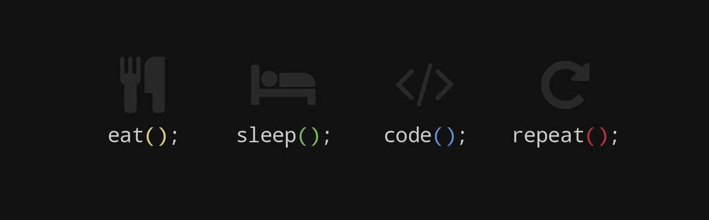
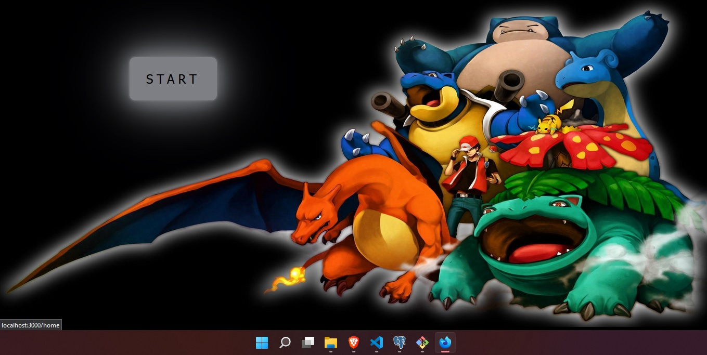
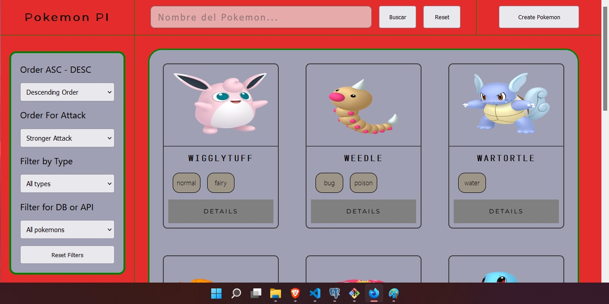
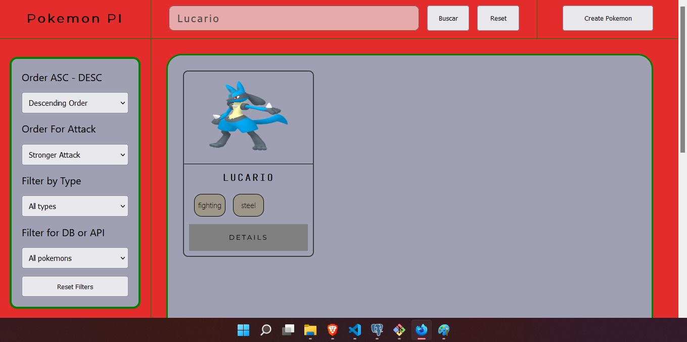
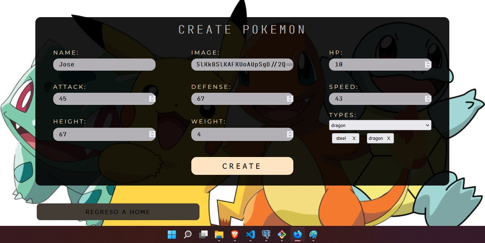
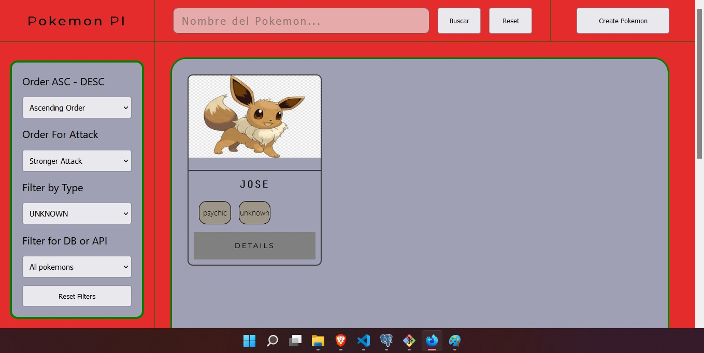

<h1 align="center">Hola, soy Jose Pardo Morales! </h1>


<br>

<div>
  <p>
    Soy una persona bachiller en ingenieria en Sistemas, autodidacta en aprendizaje constante, enfoncando mi energía en resolución de problemas atraves de la tecnologia. 
  </p>
  <strong>Es una breve descripción de mis convicciones:</strong>
</div>

<br>

## Languages and tools:

<p>
  <code></code>
  <code></code>
  <code></code>
  <code></code>
  <code></code>
  <code></code>
  <br>
  <br>
  <code></code>
  <code></code>
  <code></code>
  <code></code>
  <code></code>
  <code></code>
</p>

<br>

## Mis proyectos:

<h2 align="center">Pokemon SPA</h2>
<p>
  <br>
  > Landing Page de la Pagina
  <a></a>
  <br>
  <br>
  > Ordenando los pokemones en forma descendiente 
  <a></a>
  <br>
  <br>
  > Busqueda de Pokemons creados por nosotros o la API 
  <a></a>
  <br>
  <br>
  > Pagina de detalle de cada pokemon
  <a></a>
  <br>
  <br>
  > Pagina de creacion de Pokemons
  <a></a>
  <br>
  <br>
  > Filtrado de los pokemons creados o la API
  <a></a>
</p>

<h4> Desarrollada con: </h4>
<ul>
  <h5>|--| FrontEnd |--|</h5>
    <li>React</li>
    <li>Redux</li>
    <li>Styled Components</li>
  <h5>|--| BackEnd |--|</h5>
    <li>NodeJs</li>
    <li>Express</li>
    <li>Sequelize</li>
</ul>

<br>

## Mis skills:

```js
const josscode95 = {
  Skills: {
      BackEnd: [
          {JavaScript: ['NodeJs', 'Express', 'Sequelize', 'postgreSQL']}
        ],
      FrontEnd: [
          {JavaScript: ['React', 'Redux']}
        ]
    },
  Proyects: [
      {BankAppMe: ['React-Native', 'Redux', 'NodeJs', 'Express', 'Sequelize', 'Passport']}
    ],
  FutureTecnologies: ['PHP', 'Python', 'Java', 'C#'],
  Aspirations: ['IOT', 'MachineLearning', 'Big Data']
}
```

<br>

## Como contactarme:

<span>
  <a href="https://www.linkedin.com/in/josspm26/"></a>
</span>

<p align="center"></p>
